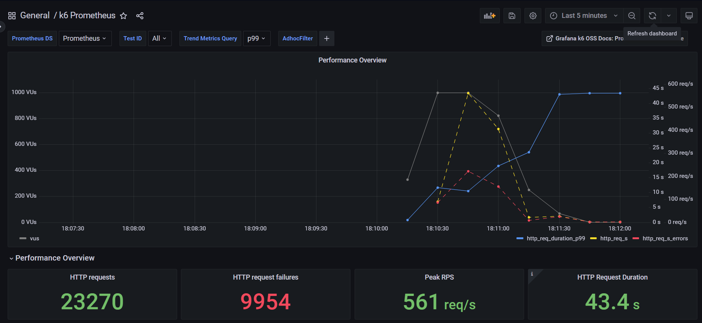
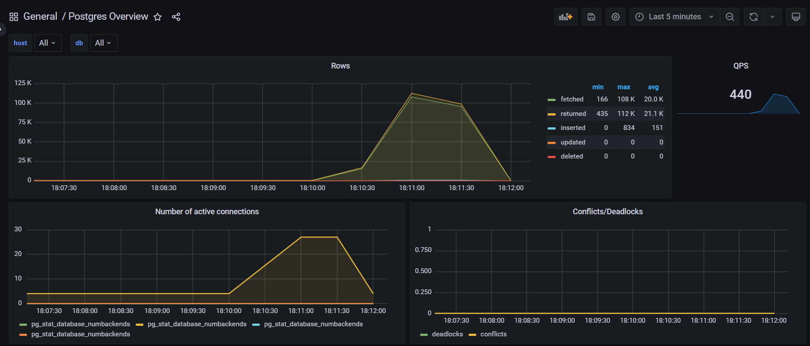
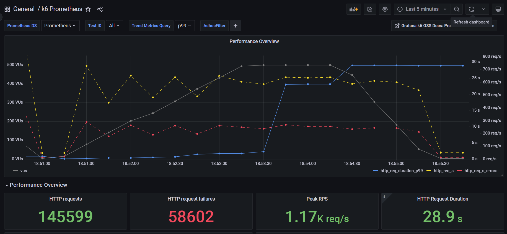
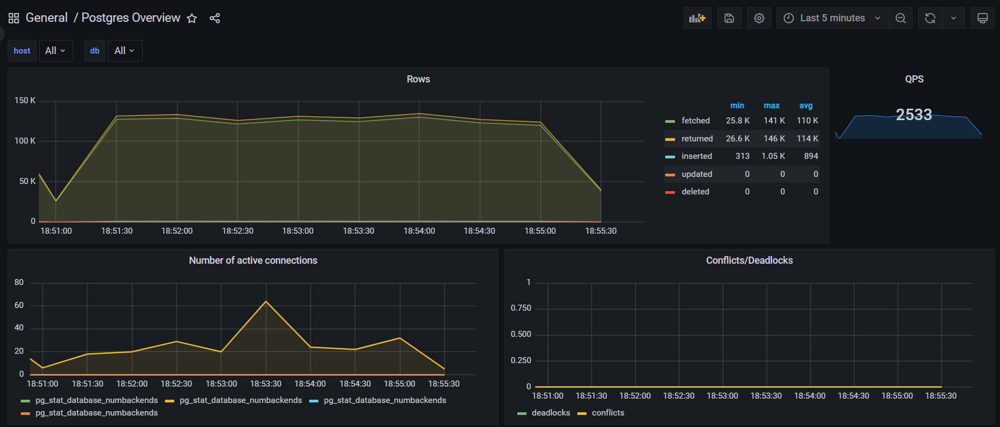
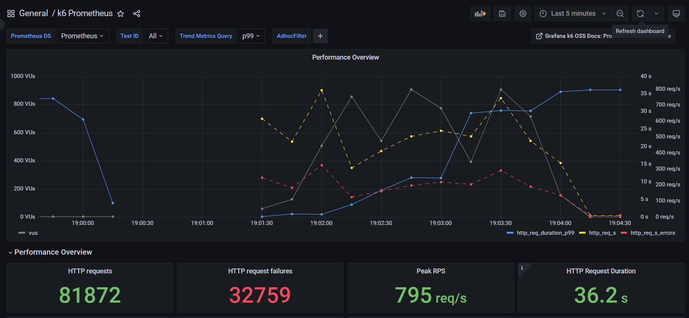
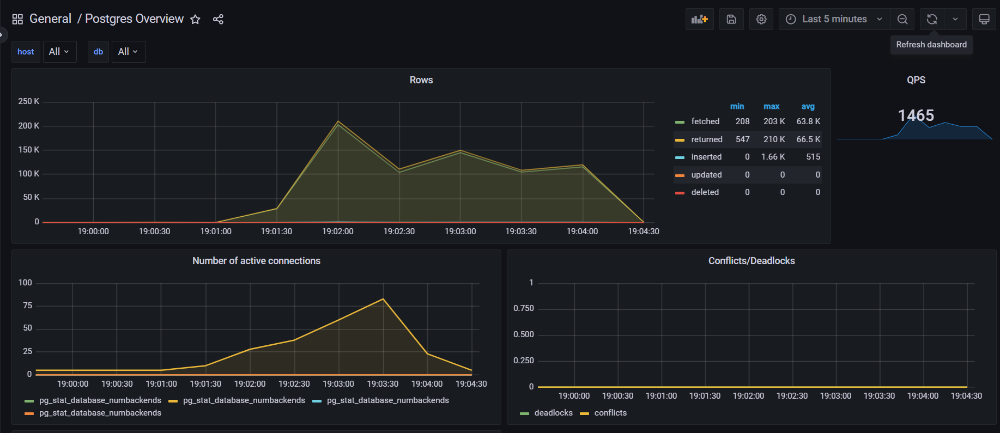

## TO DO
1. Выполните действия из README.md в demo-app-1

*  Была проблема с тем, что k6 показан как неактивный. В свежих версиях докера можно включить параметр Enable host networking, тогда он начнёт отдавать метрики на этот эндпоинт. Вот только в приложенном конфиге Prometheus начинает стучаться в k6 по hostname, а это в host_networking - не работает, мы не будем резолвить ip по имени контейнера.Можно чуть поменять конфиг прометеуса, и у нас это начнёт работать.

* Также в JSON датасорс неверный стоит. Надо зайти в общую конфигурацию датасорса графаны и скопировать из URL ID прометеуса, после чего заменить в джсонах неверный id на правильный, тогда он не будет сыпать ошибками. Так проще, чем вручную менять в графиках.

2. В вашем репозитории добавьте файл hw1/HW_1_SOLUTION.md

* Если вы читаете это, он создан.

### Этап №1: Думаем и проектируем
3. Еще раз присмотритесь к архитектуре, коду приложения и проанализируйте - какие метрики мы хотим отслеживать, чтобы понять, что происходит с нашей системой? Вкратце опишите ваши мысли в HW_1_SOLUTION.md

Архитектура: UI, NGINX (reverse proxy), backend (2 инстанса), PostgreSQL. Параллельно работают Prometheus и exporters (node_exporter, postgres_exporter, cAdvisor) и Grafana. Нагрузку создаёт k6.

Нам нужны метрики чтобы связать ошибки и латентность с причинами (ресурсы, БД, контейнеры). Под нагрузкой деградация чаще всего возникает в одном из мест:
* backend: CPU/конкурентность/GC, ожидание БД, таймауты, рост латентности по ручкам
* PostgreSQL: рост числа подключений, блокировки, IO/cache miss, saturation по CPU/диску
* NGINX: upstream timeout/ошибки проксирования (симптомы)
* host/containers: нехватка CPU/RAM, IO wait, сеть

Поэтому рассмотрим следующие виды метрик.

* Метрики симптомов. Что видит пользователь и k6, показывают что система начала деградировать, и где находится точка насыщения. Фиксируем когда стало плохо (рост p95/p99 и error rate) и на какой нагрузке.
    * Латентность k6_http_req_duration_* (p95/p99/min/max)
    * Нагрузка k6_http_reqs_total и  k6_vus (активные виртуальные юзеры)
    * Доля failed запросов k6_http_req_failed_rate и сравнение expected/failed
    * Качество выполнения сценария k6_checks_rate, k6_dropped_iterations_total, k6_iteration_duration_*
* Метрики бэка. Реализован экспорт метрик Prometheus через /metrics, и есть базовые SLI на уровне API. Можно понять какие эндпоинты деградируют, отделить деградацию по статусам (рост 500/timeout), понять что проблема в БД.
    * Количество запросов http_requests_total{method,path,status}
    * Длительность запросов http_request_duration_seconds{method,path,status}
    * Длительность SQL-запросов db_query_duration_seconds
* Метрики ресурсов. Если p95/p99 выросли, смотрим, что произошло с CPU, памятью, iowait/pressure, сетью. Это помогает отличить узкие места БД и бэка от упора в железо.
    * ЦП и нагрузка node_cpu_seconds_total (раскладка по режимам, включая iowait), node_load1 (и производные), node_pressure_*_waiting_seconds_total (PSI: признаки ожидания CPU/mem/io)
    * Память node_memory_MemTotal_bytes, node_memory_MemAvailable_bytes, node_memory_Cached_bytes
    * Сеть node_network_receive_bytes_total, node_network_transmit_bytes_total
    * Занятое диска node_filesystem_size_bytes, node_filesystem_avail_bytes
* Метрики БД. Нет ли упора в коннекты, нет ли дедлоков, не ушли ли в диск (blks_read растёт относительно blks_hit).
    * Транзакционная активность pg_stat_database_xact_commit, pg_stat_database_xact_rollback
    * Нагрузка на чтение-запись pg_stat_database_tup_returned/fetched/inserted/updated/deleted
    * Подключения и конфликты pg_stat_database_numbackends, pg_stat_database_deadlocks,pg_stat_database_conflicts
    * Кэш и IO pg_stat_database_blks_read, pg_stat_database_blks_hit 
    * Фоновая запись pg_stat_bgwriter_buffers_*


4. Если каких-то метрик не хватает по вашему мнению, пожалуйста, добавьте их в приложение (под звездочкой).

Добавил 5 метрик в main.go.

1) http_in_flight_requests (Gauge)

Сколько HTTP-запросов сейчас одновременно обрабатывается backend. Индикатор насыщения. Если растёт — backend не успевает, дальше растут p95/p99 и ошибки.

2) db_pool_in_use_connections (Gauge)

Сколько соединений к БД прямо сейчас занято (из db.Stats().InUse). Показывает фактическую параллельность доступа к БД. Если постоянно высоко - БД или пул под давлением.

3) db_pool_open_connections (Gauge)

Сколько всего открытых соединений (InUse + Idle) (db.Stats().OpenConnections). Помогает понять, раздулся ли пул, и косвенно — не уходим ли в exhaustion по коннектам.

4) db_pool_wait_count_total (Counter)

Сколько раз запросы ждали свободное соединение из пула (db.Stats().WaitCount в counter через delta). Сигнал bottleneck. Если rate(...) > 0, значит начались ожидания, и есть упор в лимиты пула или БД.

5) db_pool_wait_duration_seconds_total (Counter)

Суммарное время ожидания соединения (db.Stats().WaitDuration) в секундах, как counter через delta. Показывает цену ожиданий, растёт до того, как начнутся массовые 5xx.

### Этап №2: Стреляем
5. Если вам не нравится k6, используйте JMeter или Locust или Яндекс.Танк. Но нам нужно пострелять. Можно использовать LLM.
6. Вкратце опишите ваши мысли и сценарии в HW_1_SOLUTION.md
Стреляем с разными сценариями:
* Сценарий "Шторм" - резкий пик нагрузки (1000 пользователей за 10s)

    Хотим проверить, выдержит ли система резкий скачок нагрузки без обвала, увидеть, появляются ли очереди и таймауты, отваливается ли БД, посмотреть, восстановится ли система после снятия нагрузки.

```
export let options = {
  stages: [
    { duration: '10s', target: 1000 }, // резкий разгон
    { duration: '30s', target: 1000 }, // короткое удержание
    { duration: '20s', target: 0 },    // спад
  ],
};
```

* Сценарий "Волна" - плавное нарастание (0 к 500 пользователей за 2 минуты)

    Хотим найти точку насыщения системы, увидеть момент перелома по p95/p99, error rate и ресурсам, понять, какой компонент начинает деградировать первым при постепенной нагрузке.

```
export let options = {
  stages: [
    { duration: '2m', target: 500 }, // плавный рост
    { duration: '1m', target: 500 }, // удержание
    { duration: '1m', target: 0 },   // плавный спад
  ],
};
```

* Свой сценарий - измените существующий скрипт каким-нибудь способом. Сделайте себе заметки - в чем фишка вашего сценария? Может, вы хотите проверить что-то другое в нашем приложении или хотите задать нагрузку иного характера?

    Моя модификация: "Пики". Базовая нагрузка 200 юзеров, периодические короткие всплески до 1000 юзеров, затем возвращение к базовой нагрузке, несколько повторов. Хотим проверить способность системы переживать повторяющиеся пики, обнаружить накопительные эффекты (например рост ожиданий пула БД, рост очередей, долгое восстановление), отличить поведение системы при одиночном пике от серии пиков.

```
export let options = {
  stages: [
    { duration: '30s', target: 200 },  // базовая нагрузка
    { duration: '10s', target: 1000 }, // пик 1
    { duration: '30s', target: 200 },
    { duration: '10s', target: 1000 }, // пик 2
    { duration: '30s', target: 200 },
    { duration: '10s', target: 1000 }, // пик 3
    { duration: '30s', target: 0 },    // завершение
  ],
};
```

### Этап №3: Анализируем
7. Проанализируйте дашборды после/во время каждого сценария и найдите на графиках "инсайты", которые помогут сделать выводы.
Например, при резком скачке нагрузки у нас отваливается База Данных или максимальная нагрузка приложения - 20 000 RPS на такой-то конфигурации или при максимальной нагрузке у нас 50 коннектов к базе или латенси такой-то в 95-перцентиле.
8. Свяжите анализ с этапом №1 и напишите в HW_1_SOLUTION.md ваши мысли.

    1. **Сценарий Шторм**  
    
    

    

    * Метрики k6:

        Нагрузка поднималась до 1000 VU. Peak RPS 561 req/s, 50 878 запросов, 670 req/s. Доля ошибок высокая, http_req_failed 40%. Латентность резко деградирует по хвостам. http_req_duration p(95) = 2.3s, но max = 1m, то есть имеются зависшие запросы.На дашборде k6 p99 подскакивает до 43s. GET list ok почти всегда успешен, ошибок мало, а основная проблема — в POST created, успешность около 49%.

        Система в момент резкого пика способна генерировать сотни req/s, но качество резко падает: большой error rate и длинный хвост latency до 1 минуты.

    * Метрики backend на пике нагрузки:

        http_in_flight_requests = 1952

        db_pool_open_connections = 1949

        db_pool_in_use_connections = 1947

        rate(db_pool_wait_count_total[1m]) = 0

        rate(db_pool_wait_duration_seconds_total[1m]) = 0

        Http_in_flight_requests почти в 2 раза больше числа VU, запросы копятся и долго висят в обработке, что совпадает с хвостами latency (1 мин). Это признак, что backend перестаёт успевать и формирует очередь запросов. Wait-метрики = 0 при 1900 open/in_use, значит в приложении отсутствует ограничение пула database/sql (MaxOpenConns не задан). Вместо управляемого ожидания соединения система открывает и держит огромное число соединений (connection storm). Это ухудшает стабильность и способствует росту хвостовой латентности.

    * Метрики БД

        QPS = 440. Число активных подключений на пике поднималось до 27. Deadlocks/Conflicts = 0.

        БД не падает, но под нагрузкой наблюдается рост QPS и подключений. При этом на стороне приложения видна аномально много соединений — значит деградация проявляется скорее в слое управления соединениями и конкуренцией, чем в явных блокировках БД.

    * В данном сценарии метрики этапа 1:

        k6 показал деградацию качества (ошибки и p99).

        http_in_flight_requests подтвердил накопление очереди.

        db_pool_* показали неконтролируемый рост соединений без ожиданий.

        БД не показала конфликтов значит причина не в блокировках, а в перегрузке ресурсов на уровне приложения и соединений.

    2. **Сценарий Волна**  
    
    

    

    * Метрики k6

         Нагрузка плавно росла до 500 VU, затем держалась и спадала. http_reqs = 577 req/s, k6 Peak RPS = 1.17k req/s. http_req_failed = 40.17% — уровень ошибок остаётся очень высоким, но list ok почти всегда успешен (28976 OK / 26 fail), основная доля ошибок приходится на created (58633 OK / 58812 fail). Латентность при Волне стала ниже, чем в Шторме p95 = 1.84s, но хвост всё ещё тяжёлый: max = 1m3s.

         Плавный рост делает систему в среднем быстрее, но проблемы остаются: высокий error rate и длинный хвост говорит о накоплении ожиданий в пике.

   * Метрики backend на пике нагрузки:

        http_in_flight_requests = 971

        db_pool_open_connections = 963

        db_pool_in_use_connections = 963

        rate(db_pool_wait_count_total[1m]) = 0

        rate(db_pool_wait_duration_seconds_total[1m]) = 0

        При 500 VU одновременно в обработке висит 971 запрос. Это подтверждает, что при росте нагрузки запросы начинают скапливаться и часть уходит в очень длинный хвост. Снова отсутствуют ожидания на пуле (wait=0), но число открытых коннектов растёт почти до тысячи. Это признак отсутствия лимитов пула соединений на уровне приложения, потенциальный connection storm, который ухудшает стабильность под нагрузкой.

   * Метрики БД

        QPS = 2533. Активные подключения колебались и имели пик, затем снижались. Deadlocks/Conflicts = 0.

        БД не падает, но под нагрузкой растёт активность и коннекты. При этом основной паттерн деградации проявляется в хвостах latency и росте конкурентности на стороне приложения.

   * В данном сценарии метрики этапа 1:

        при росте нагрузки хвостовая латентность растёт (p99 на дашборде уходит в десятки секунд)

        растёт http_in_flight_requests (формируется очередь)
            
        растут db_pool_open/in_use при нулевом ожидании пула (wait=0), что указывает на отсутствие лимитов пула и риск коннект-штормов.

    3. **Сценарий Пики**  
    
    

    

    * Метрики k6

        На пике доходило до 1000 VU, профиль нагрузки рваный. http_reqs = 546 req/s, Peak RPS = 795 req/s. http_req_failed = 40.11% — уровень ошибок стабильно высокий, list ok почти всегда успешен: 17610 OK / 19 fail, created примерно пополам: 34985 OK / 35219 fail. Латентность при Пиках p95 = 2.73s (хуже, чем Волна, ближе к Шторму), тяжёлый хвост: max = 1m3s. На графике k6 видно, что p99 растёт при каждом пике (до десятков секунд), т.е. хвостовая деградация повторяется волнами.

        Рваный профиль вызывает повторяющиеся всплески p99 latency и ошибок. Система не держит стабильный SLA на хвостах и деградирует при каждом пике.

    * Метрики backend на пике нагрузки:

        http_in_flight_requests = 1844

        db_pool_open_connections = 1907

        db_pool_in_use_connections = 1905

        rate(db_pool_wait_count_total[1m]) = 0

        rate(db_pool_wait_duration_seconds_total[1m]) = 0

        In-flight почти 2k — значит во время пиков запросы копятся. Это напрямую коррелирует с длинным хвостом latency и скачками p99. Число открытых коннектов 1900 при wait=0 означает, что приложение не ограничивает пул соединений к БД. Вместо управляемого ожидания соединения система раздувает число коннектов, что ухудшает стабильность и может объяснять длинные хвосты и ошибки на пиках.

    * Метрики БД

        QPS = 1465. Активные подключения росли и на пике доходили до 80. Deadlocks/Conflicts = 0.

        БД не демонстрирует конфликтов, деградация выражается не в блокировках, а в росте конкурентности и нагрузке. При этом на уровне backend видна аномально высокая масса соединений, что указывает на проблему управления соединениями в приложении.

    * В данном сценарии метрики этапа 1:

        каждый пик влечет рост in-flight, что влечет рост p99/max latency,

        каждый пик влечет рост db_pool_open/in_use при wait=0, а это признак отсутствия лимитов пула и коннект-штормов.

### Этап №4: Решения
9. Я буду признателен, если вы предложите решения - как справится с той или иной нагрузкой. 

Для всех трех случаев будет справедливо:

   * Ограничить пул соединений в backend. Сейчас pool не ограничен, поэтому при пике возникает коннект-шторм. Нужно задать db.SetMaxOpenConns(50-100), db.SetMaxIdleConns(10–20), db.SetConnMaxLifetime(5 мин). За этим последует уменьшение числа одновременных соединений, появление контролируемого ожидания (wait_count>0), снижение хвоста p99 и стабилизация системы под пиком.

   * Защитить систему от резкого пика. Лимитирование на входе (NGINX limit_req, limit_conn) или на уровне приложения. Таймауты на запросы к БД/HTTP, чтобы запросы не висели.

   * Горизонтальное масштабирование бэка и балансировка, убедиться, что NGINX реально балансирует на оба бэка, при необходимости поднять больше реплик (при условии лимитов пула и что БД выдержит) для роста пропускной способности. 

   * Оптимизация работы с БД - индексы, батчинг и кэширование запросов.
