## Настройка и подготовка

Работаю с винды, поэтому перевожу все в LF

```docker run --rm -v "%cd%":/src alpine sh -c "apk add --no-cache dos2unix >/dev/null && dos2unix /src/docker/entrypoint.sh"```

```docker run --rm -v "${PWD}:/src" alpine sh -c "apk add --no-cache dos2unix >/dev/null && find /src -type f \( -name '*.sh' -o -name '*.py' -o -name '*.yml' -o -name '*.yaml' -o -name '*.tmpl' -o -name '*.toml' \) -print -exec dos2unix {} \;"```

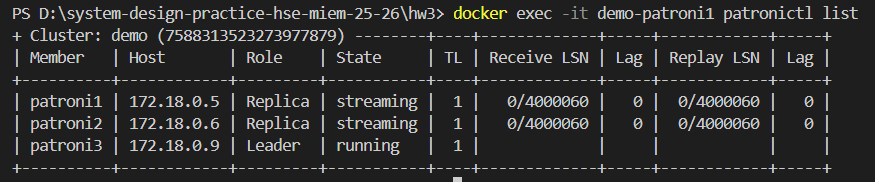

Кластер demo состоит из 3 PostgreSQL-нод под управлением Patroni: patroni3 — лидер (мастер), patroni1 и patroni2 — реплики в состоянии streaming. Отставание реплик нулевое (Lag=0), Receive/Replay LSN совпадают, значит репликация работает корректно. Координация лидера и failover выполняется через etcd-кластер, а подключение клиентов маршрутизируется через HAProxy.

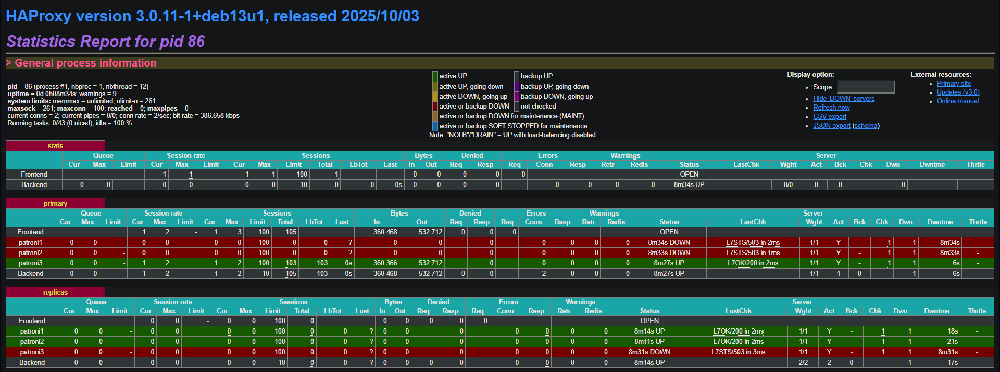

HAProxy автоматически держит актуальную схему маршрутизации: запись идёт только на текущего лидера (patroni3), чтение — на реплики (patroni1, patroni2). При смене лидера HAProxy должен переключить UP в backend primary на нового лидера без ручной перенастройки.

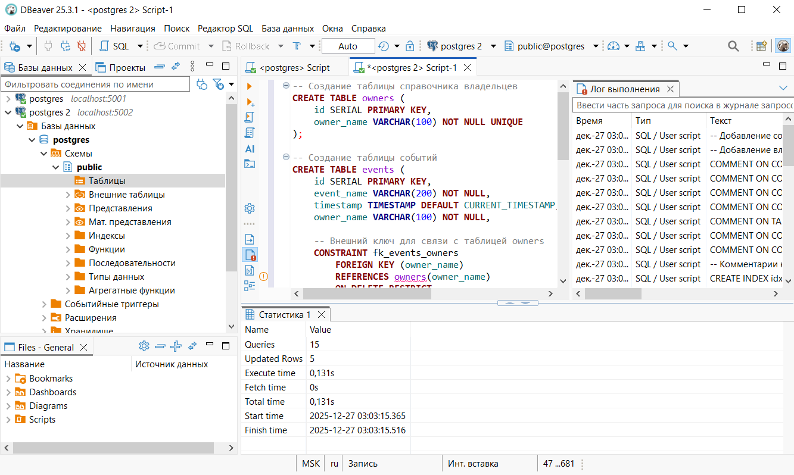

Из-за проброса портов в docker-compose (5002→5000, 5001→5001) write-endpoint оказался на порту 5002. Проверили через pg_is_in_recovery(): на 5002 значение false (лидер), на 5001 true (реплика). Поэтому скрипт выполняли на 5002, а на 5001 проверяли репликацию через SELECT

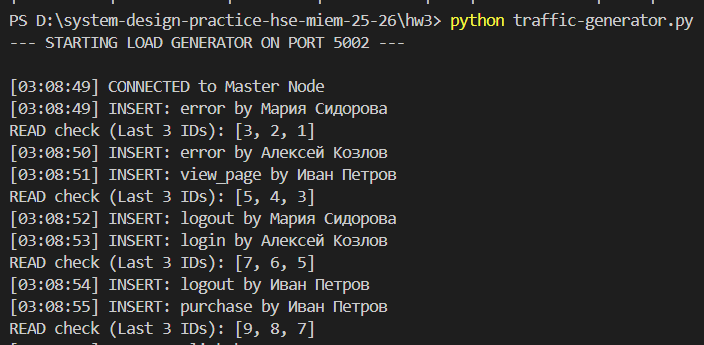

Запускаем скрипт и видим как сыпятся данные.

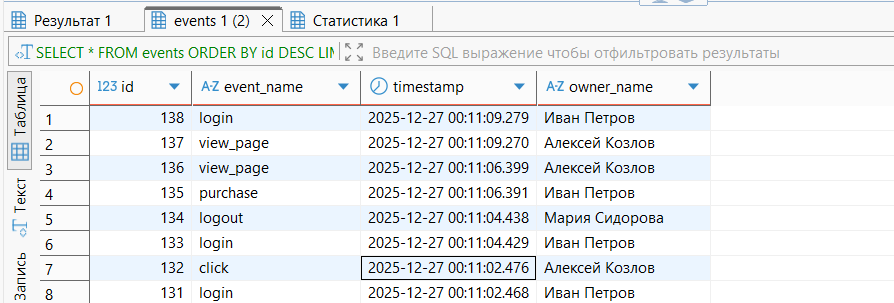

Видим новые записи в БД на 5002.

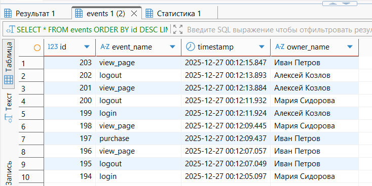

Видим новые записи в БД на 5001.

## Эксперимент A: выключаем реплику Patroni

Остановим одну реплику patroni1. Стрелялка продолжает работать, запись идёт в лидера, чтение может перейти на оставшуюся реплику. В patronictl list и HAProxy остается лидер + 1 реплика.

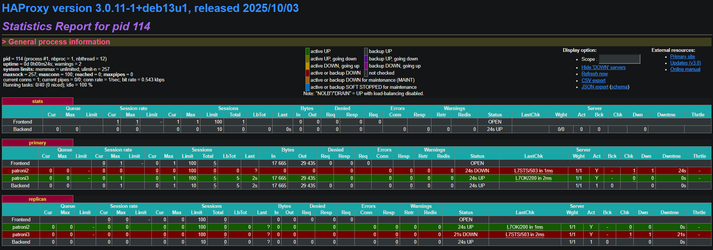

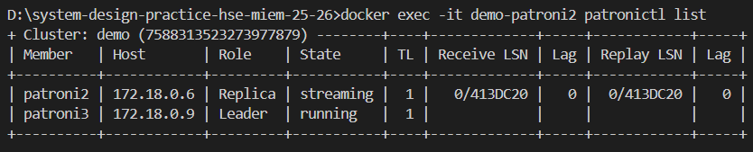

После включения все снова как прежде.

## Эксперимент B: выключаем лидера Patroni (failover)

Остановим лидера patroni3.

В stdout стрелялки видим ошибку и остановку стрельбы.

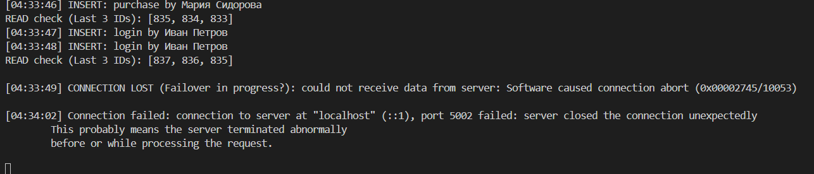

Видим, что в HAProxy все легли.

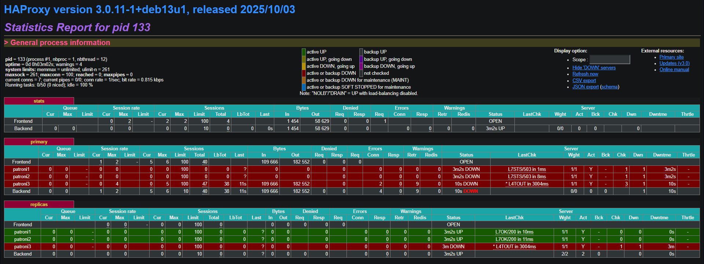

Но затем назначили нового лидера.

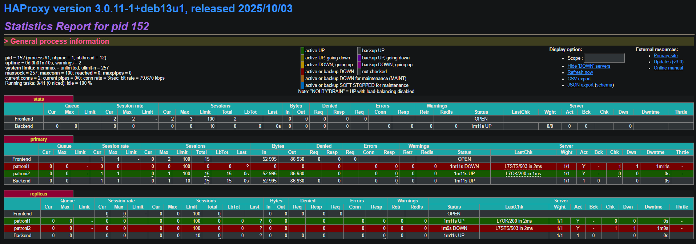

И вот уже живые две patroni.

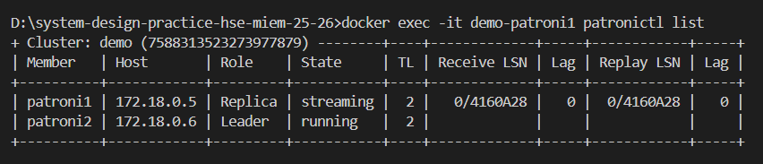

В моем случае, ни подождав несколько минут, ни перезапустив patroni3, стрелялка так и не ожила, хотя по идее должна была, раз назначили нового лидера.

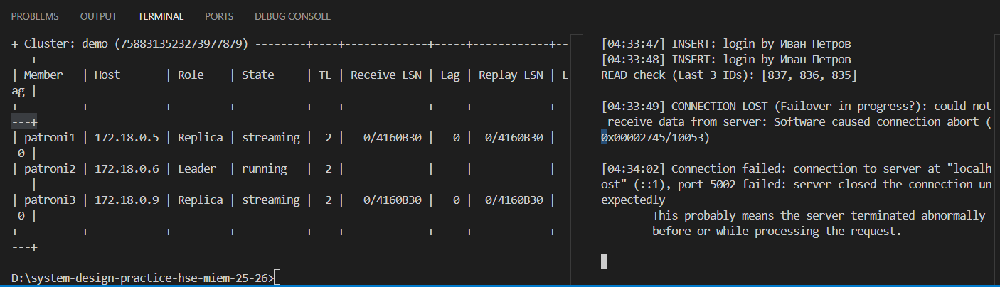

## Эксперимент C: выключаем etcd (проверяем кворум)

Остановим одну etcd ноду ```docker stop demo-etcd1```. Всё продолжает работать, 2/3 кворум есть.


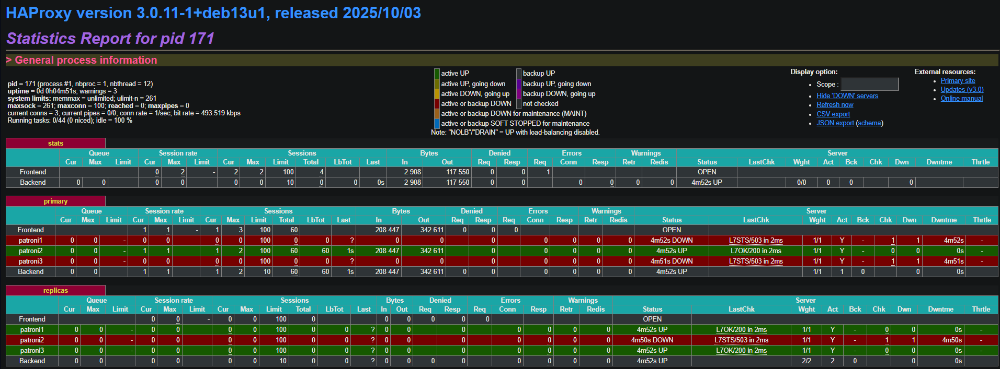

Остановим еще одну etcd ноду, кворума нет. Лидер продолжает обслуживать запросы несколько секунд, но управление кластером (failover, смена лидера, обновление статуса) ломается, выскакивают ошибки, что сервер недоступен

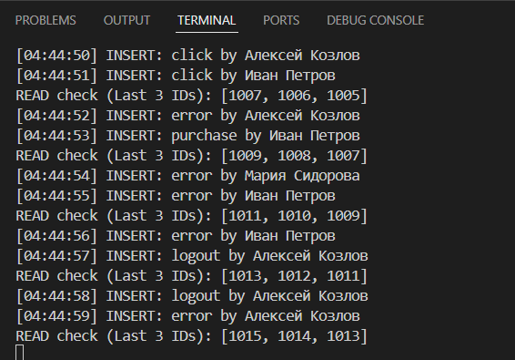

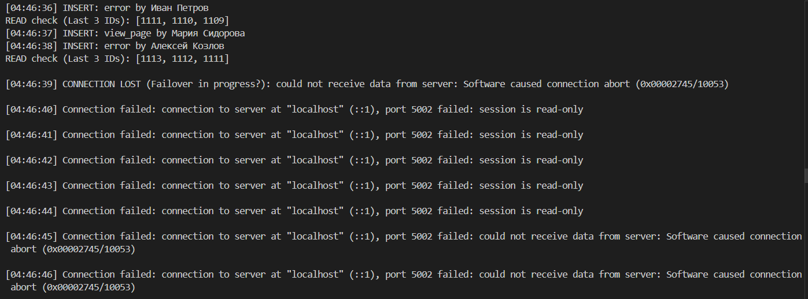

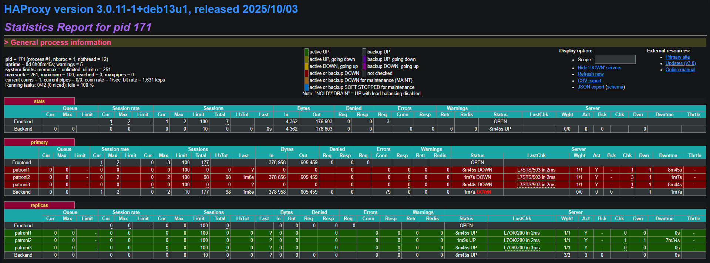

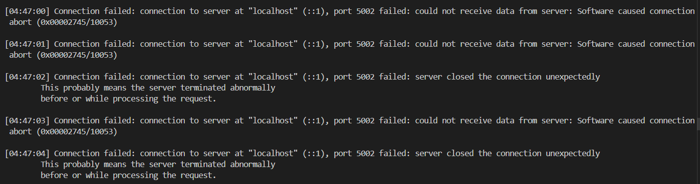

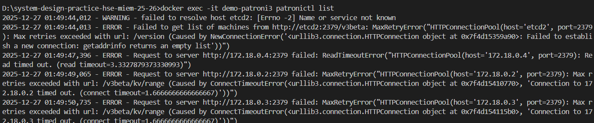

## Эксперимент D: выключаем HAProxy (SPOF)

```docker stop demo-haproxy```

Стрелялка, которая ходит через localhost:5001/5002, падает по соединению (connection refused), при этом ноды живы. При этом HAProxy также упал. Причина в том, что пропала точка входа.

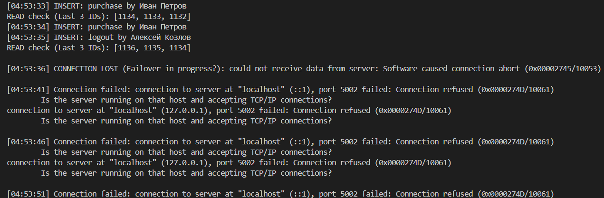

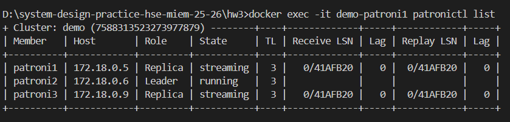

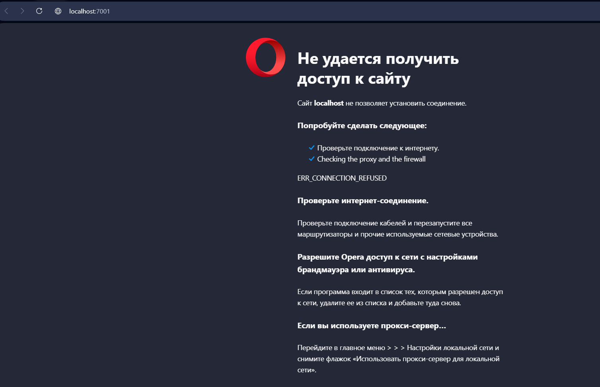